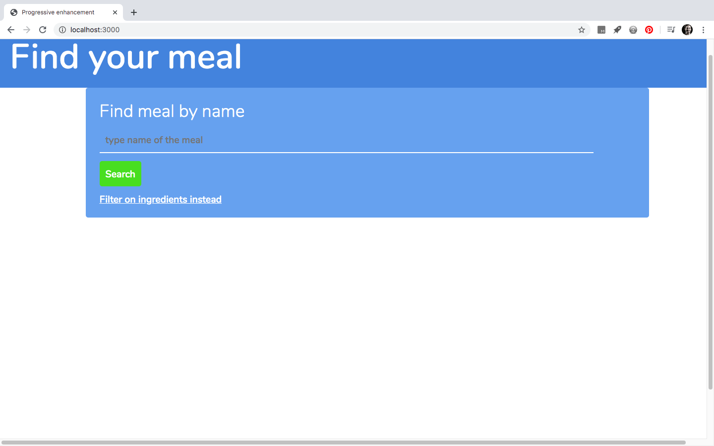
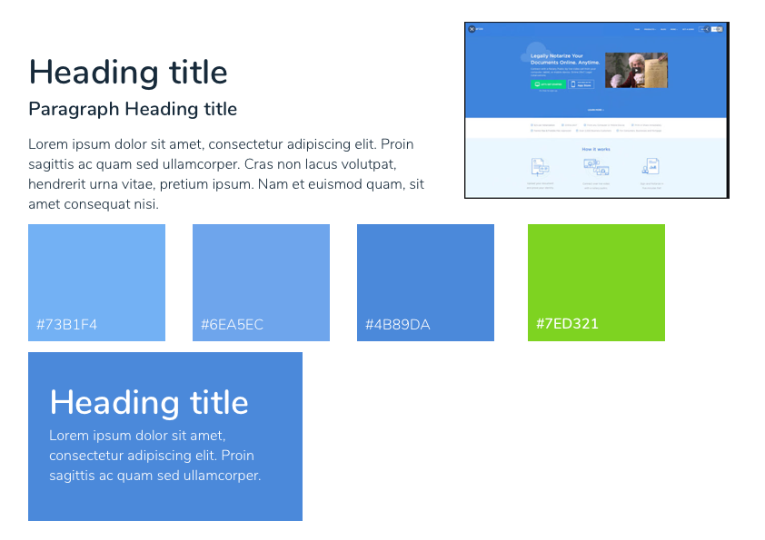

# FE2-resit

*A progressively enhanced website for finding your next meal*

## Table of contents
1. [The assignment](#The-assignment)
2. [My product](#My_product)
  - [Styleguide](#Styleguide)
3. [What is progressive enhancement](#Wath-is-progressive-enhancement)
  - [Functional and reliable](#Functional-and_reliable)
    - [Server side rendering](#Server-side-rendering)
    - [Pagination](#Pagination)
    - [Datalist element](#Datalist-element)
  - [Useable](#usable)
    - [@supports](#@supports)
    - [Fonts and colors](#Fonts)
  - [Pleasurable](#Pleasurable)
    - [hydration](#hydration)
    - [loader](#loader)
    - [noscript](#noscript)
    - [Infinite scrolling](#Infinite-scrolling)
    - [Lazy loading](#Lazy-loading)
4. [Todo](#Todo)
5. [Sources](#sources)

## The assignment
This assignment was made in response to the Frontend 2 course on CMD. The contents of the course revolved around progressive enhancement and the core foundations of the Javacript language.
I choose to build a website in which I show that I understand the principle of Progressive enhancement.

## My product
I choose to make a website in which a user can search for a meal recipe. The user can search on ingredients or dish name. After submitting the request, the users gets acces to a list of recipes. The challenge in this assignment was to make the web app useable for every kind of user and browser. Even without css and Javascript, the core functionalities of this website still work.

### Styleguide


## What is progressive enhancement
Progressive enhancement concists two things. One, is that the user gets to use the core functionalities of your product (in my case, a website) regardless of the kind of browser, bandwidth and/or device. The second, is that progressive enhancement revolves about gradually improving the user experience while confirming that the client device/browser/bandwidth is capable of it.
My plan was to progressively enhance the website from the ground up. So I devided the development of the product in three stages. This way of developing a website stands in contrast to Graceful degregation, in that it doesn't cater to the most advanced browsers first.

### Functional and reliable
The functional and reliable stage stands for the most minimal and basic setup of the website. In this stage, the website always works, regardless of the client's device/browser/bandwidth.

#### Server side rendering
To accomplish the functional and reliable, I wrote a server with Express. The server delivered all of the data to the client using the Handlebars templating. In this way, the user only needs to have a html form that can submit some data the server. The server in return, fetches the api, formats the data and gives it back to the client. Working with a server gives you a huge amount of progressive enhancement points! No client js or css is required. Also, as a developer you are challenged to work more with native html api's instead of fancy bloated js libraries.

#### Pagination
Sometimes when you search for a specific dish or ingredient, the api returns alot of results. (for example Chicken). It would be awesome if we can provide the user with some kind of pagination. I didn't know if I could fix a server side pagination so I decided to challenge myself on it. Eventually, I've came up with a solution.
I've had to count the total results and divide it by the number of recipes per page.

```js
  let total_pages = Math.ceil(meals.length / per_page)
```
The first page that gets return after the post request is ofcourse page number one. By using `.slice(0, 8)` on the array that gets returned from the api, 8 items will get returned to the client.
`total_pages` returns the number of pages that the returned data must contain. Using that information I can render a 'next page' link in the template.

```hbs
//let next_page = next_page === 0 ? null : next_page + 1,
  {{#if next_page }}
    <a href="/page/{{ next_page }}/search/{{ query }}">Next page</a>
  {{/if}}
// query is the requested ingredient
```

Using the page and query parameters in the route, I can fetch the api and use the `paginator` function again. Returning an array with 8 new meals to the template.

#### Datalist api
It would be cool to provide some sort of autocomplete functionality, even in this state. I've researched into 'serverside autocomplete' and found almost nothing useful. If it was useful, it was way too complex for this size of an app. Until I stumbled onto the html [datalist element](https://developer.mozilla.org/en-US/docs/Web/HTML/Element/datalist). Now I use the datalist tag to show a list of recommended search items. Using this, I can give some sort of autocomplete. Not only does the datalist return a fixed set of recommendations, but it also shows your searchterm history.

### Usable
The usable is the state in which we have acces to CSS to enhance the user experience.
Using css to make things pretty is awesome but we still have to account for the browser of the client.
For example; we can use Flexbox to make a layout but according to [caniuse](https://caniuse.com/#search=display%3A%20flex) there are still browsers that do not support Flexbox, rendering our layout into a total mess. That is why we have to provide the user with proper css fallbacks.

#### @supports
```css
@supports (display: flex){
  main {
    display: flex;
    flex-direction: column;
  }
```
with the @supports (or also know as a feature query) rule we can check if the browser of the client supports flexbox. If it does support flexbox, this block of code gets applied. If it does not, it does not get applied. This is a cool feature but we have to provide fallbacks. In this case, the `<main> </main>` contains our date of the recipes. And just to be sure, I render that data in a `<ul></ul>`. So eitherway, the data gets rendered as a vertical list. If this wasn't the case we could provide a layout with `float`.
Thinking about semantic html really makes life more easier sometimes.

Important to know is that @supports is [not supported](https://caniuse.com/#feat=css-featurequeries) by Internet Explorer at all!

#### Fonts
I've imported the custom fonts using the @font-face css rule.
Although the font-face rule is supported in alot of browsers, it is still advisable to provide fallback fonts. The fonts that are used in this website are downloaded from google fonts. After that I converted them to two file formats. `woff2` and `woff` are readable by all current browsers that support custom fonts.

```css
@font-face {
  font-family: 'nunitolight';
  src: url('../fonts/nunito-light-webfont.woff2') format('woff2'),
      url('../fonts/nunito-light-webfont.woff') format('woff');
  font-weight: normal;
  font-style: normal;
}
```

When declaring fonts on, for example a `h1`, it is advisable to also declare some fallback fonts just in case the clients browser does not support the custom font.
`nunitosemibold` is the custom font. Then I declare `Roboto` as a fallback. Roboto is one of the [websafe](https://websitesetup.org/web-safe-fonts-html-css/) fonts. If Roboto is not available, then the browser can show the system font. If everything else failes, fall back to a sans-serif font.

```css
h1 {
  color: darkblue;
  color: #172A3A;
  color: var(--darkblue);
  font-family: 'nunitosemibold', Roboto, system-ui, sans-serif;
}
```

For colors it is also advisable to provide some fallbacks. The order in which we declare a css rule, determines what becomes applied to the element.
The most modern browsers support `var(--darkblue)`. These are css variables that we declared on top of the [stylesheet](https://github.com/Techdemo/FE2-resit/blob/master/public/css/styles.css#L57). Not all browsers *..couch IE11* do support css variables. When the browser can't read the variable, it will apply the rule specified before that. If the rgb hexadecimal notation does not work, then show the user the browser's interpertation of darkblue.

This is another example of how we can provide the user with css fallbacks.

```css
p {
  font-size: 16px;
  font-size: 1rem;
  font-size: calc(16px + (20 - 16) * ((100vw - 300px) / (1600 - 300)));
}
```

### Pleasurable
The pleasurable stage is acessible for the modern browsers. This is when we have acces to client side Javascript.

### Hydration
Hydration occurs when pages are server side rendered, but we change the dom by performing client side actions. This is a good way to demonstrate progressive enhancement. Alot of actions can be made more pleasurable this way.

I decided to apply the concept of hydration to the fetching of the api. On my server I provided a seperate api route that only fetches the api and returns that data. The difference with the previous routes used in the app is that it doesn't return instructions a Handlebars template. Client side renders the recipe cards into our dom.

```html
<form action="/" method="POST" onsubmit="searchSingleMeal();">
// when Javascript is client side available, the searchSingleMeal() function gets called.
// With event.preventDefault() we prevent the page from refreshing
```

By submitting the form, the api gets called client side.
The rest of the code is [here](https://github.com/Techdemo/FE2-resit/blob/master/public/js/index.js#L64).

### Loader
To provide the user with a pleasurable user experience while fetching the api, the clientside Jvascript can provide the user with a fancy loader animation.
While fetching the api, we place a div element with class loader in our DOM by calling `loader()`
```js
const loader = () => {
  sanitize()
  const markup =
    `<div class="loader">Loading..</div>`
  cardList.insertAdjacentHTML("afterbegin", markup)
}
```
The `sanitize()` function removes al html nodes in the container before the loader div gets placed. There is still text in the div because if the client's browser does not support CSS animations, it still gives us the word 'loading...'.
In our css we have to provide prefixes for our keyframe animation. In this way, it will support all of the variants in our modern browser scale. From Chrome to Opera.

```css
  @-moz-keyframes fadein
  @-webkit-keyframes fadein
  @-o-keyframes fadein
```

#### Noscript
The noscript tag allows us place content in the dom that get rendered when there is no clientside Javascript available. I've placed the server side pagination logic in a noscript tag. In this way, I can let the client side javascript replace this way of pagination into something way cooler. This also is a form of hydration.

#### Infinite scrolling
By making use of the intersection observer API in the browser, we can not only lazy load all of the images of the page but also provide the user with infinite scroll.
In this way we don't need pagination. We can check if the clients browser has the intersection observer api available in the browser window object.

The Intersection Observer API provides a way to asynchronously observe changes in the intersection of a target element with an ancestor element or with a top-level document's viewport.

```js
 if ("IntersectionObserver" in window) {
   // do stuff
 } else {
   // do other stuff when intersectionobserver is not in the window
 }
```
See the code [here](https://github.com/Techdemo/FE2-resit/blob/master/public/js/index.js#L113).
When a recipe card crosses in the users viewport, we will assign class 'fade-in' to the div. This provides a the fade-in animation when the card will get shown.

#### Lazy loading


